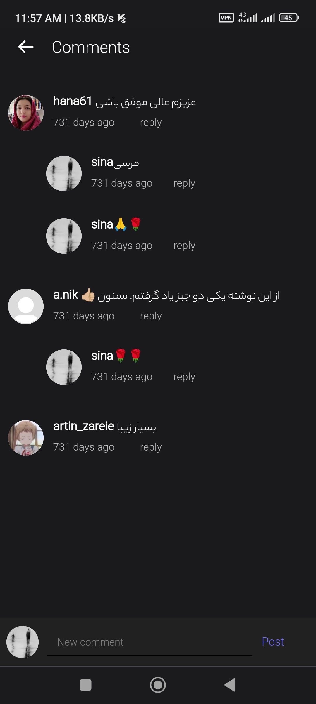
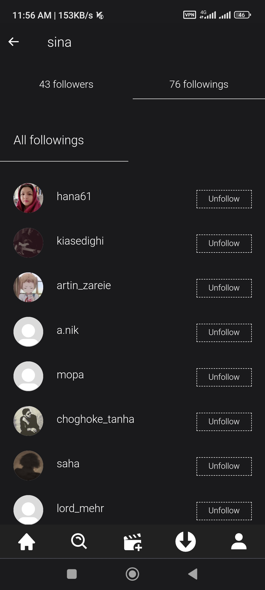
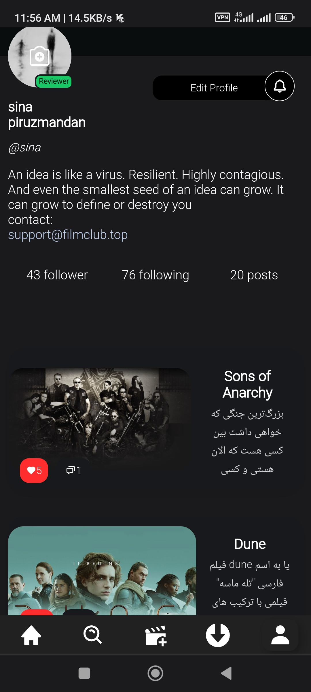
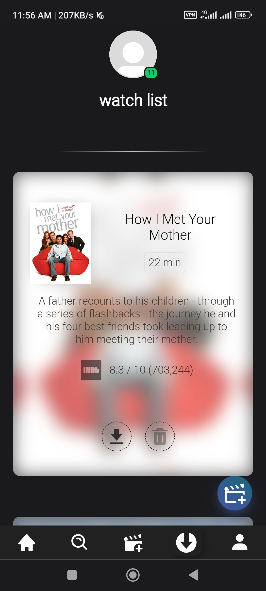
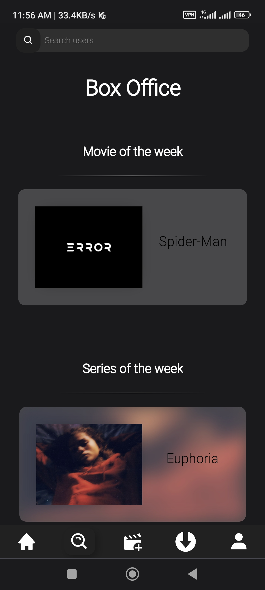
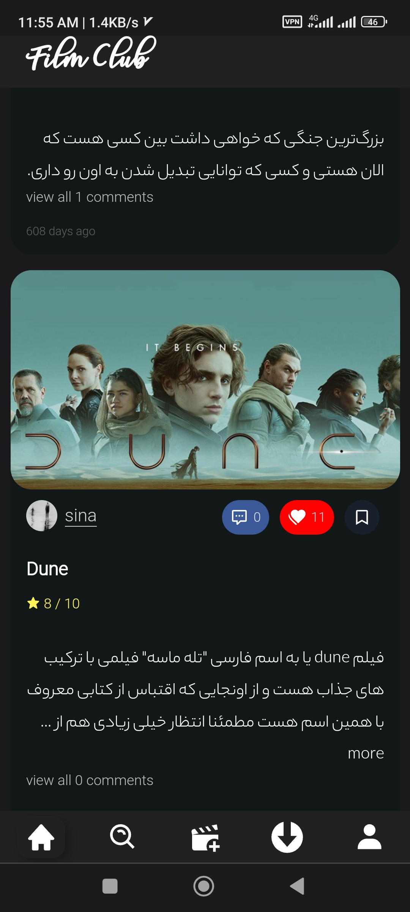

# FilmClub - Social Media Platform for Movie Enthusiasts

A modern, responsive social media platform built with Vue.js, designed specifically for movie lovers to share, discover, and discuss films. FilmClub provides a sleek, mobile-first experience with PWA capabilities.

## 🎬 Demo Screenshots

<div align="center">
  
  
  
</div>

<div align="center">
  
  
  
</div>

## ✨ Features

### 🏠 Core Functionality

- **Home Feed**: Browse and interact with movie posts from the community
- **User Profiles**: Customizable profiles with bio, follower/following system
- **Post Creation**: Rich text editor with image support for sharing movie reviews and thoughts
- **Search**: Discover users, posts, and movie content
- **Bookmarks**: Save favorite posts to your personal collection
- **Real-time Notifications**: Stay updated with likes, comments, and follows

### 📱 User Experience

- **Mobile-First Design**: Optimized for mobile devices with responsive layout
- **Progressive Web App (PWA)**: Installable app experience with offline capabilities
- **Pull-to-Refresh**: Native mobile gesture support
- **Lazy Loading**: Optimized image loading for better performance
- **Dark Theme**: Modern dark UI with custom color scheme

### 🔧 Technical Features

- **Vue.js 2**: Modern JavaScript framework
- **Vuex**: State management for complex data flow
- **Vue Router**: Client-side routing with history mode
- **Service Worker**: Offline functionality and caching
- **JWT Authentication**: Secure user authentication
- **Analytics Integration**: Matomo analytics for user insights
- **Push Notifications**: Najva integration for real-time notifications

## 🛠️ Tech Stack

- **Frontend Framework**: Vue.js 2.6.11
- **UI Library**: Vuesax 4.0.1
- **State Management**: Vuex 3.4.0
- **Routing**: Vue Router 3.2.0
- **HTTP Client**: Axios 0.21.1
- **Rich Text Editor**: EditorJS 2.22.0
- **Image Processing**: Vue Croppa 1.3.8
- **Analytics**: Vue Matomo 4.1.0
- **Build Tool**: Vue CLI 4.5.0

## 📦 Installation

### Prerequisites

- Node.js (v12 or higher)
- npm or yarn package manager

### Setup Instructions

1. **Clone the repository**

   ```bash
   git clone <repository-url>
   cd movie-front-end
   ```

2. **Install dependencies**

   ```bash
   npm install
   # or
   yarn install
   ```

3. **Development server**

   ```bash
   npm run serve
   # or
   yarn serve
   ```

   The application will be available at `http://localhost:8080`

4. **Build for production**

   ```bash
   npm run build
   # or
   yarn build
   ```

5. **Lint and fix files**
   ```bash
   npm run lint
   # or
   yarn lint
   ```

## 🏗️ Project Structure

```
src/
├── components/          # Reusable Vue components
│   ├── Home/           # Home page components
│   ├── NewPost/        # Post creation components
│   ├── profile/        # Profile page components
│   ├── search/         # Search functionality
│   └── login/          # Authentication components
├── views/              # Page-level components
├── router/             # Vue Router configuration
├── store/              # Vuex store modules
├── assets/             # Static assets (fonts, images)
└── main.js            # Application entry point
```

## 🎯 Key Components

### Navigation

- **Bottom Navigation Bar**: Quick access to main sections (Home, Search, New Post, Bookmarks, Profile)
- **Route Guards**: Authentication-based navigation protection

### Posts

- **Rich Text Editor**: EditorJS integration for creating formatted posts
- **Image Upload**: Drag-and-drop image support with cropping
- **Engagement**: Like, comment, and bookmark functionality

### User Management

- **Authentication**: Login/signup with JWT tokens
- **Profile Management**: Bio editing, avatar upload
- **Social Features**: Follow/unfollow users, view followers/following

## 🔧 Configuration

### Environment Setup

The application uses various configuration options:

- **PWA Configuration**: Defined in `vue.config.js`
- **Service Worker**: Custom implementation in `src/service-worker.js`
- **Analytics**: Matomo configuration in `main.js`
- **Push Notifications**: Najva integration setup

### Customization

- **Themes**: CSS custom properties in `App.vue`
- **Colors**: Vuesax color configuration
- **Fonts**: Custom font loading (Roboto, Yekan, Nazanin)

## 📱 PWA Features

- **Installable**: Add to home screen capability
- **Offline Support**: Service worker caching
- **App-like Experience**: Full-screen mode support
- **Push Notifications**: Real-time updates

## 🌐 Browser Support

- Chrome (recommended)
- Firefox
- Safari
- Edge

> **Note**: The application includes IndexedDB compatibility checks and graceful degradation for unsupported browsers.

## 🤝 Contributing

1. Fork the repository
2. Create a feature branch (`git checkout -b feature/amazing-feature`)
3. Commit your changes (`git commit -m 'Add amazing feature'`)
4. Push to the branch (`git push origin feature/amazing-feature`)
5. Open a Pull Request

## 📄 License

This project is private and proprietary.

## 🔗 Related

- Backend API (https://github.com/sinapir2/filmclub_backend)

---

**FilmClub** - Connecting movie enthusiasts worldwide 🎬✨
